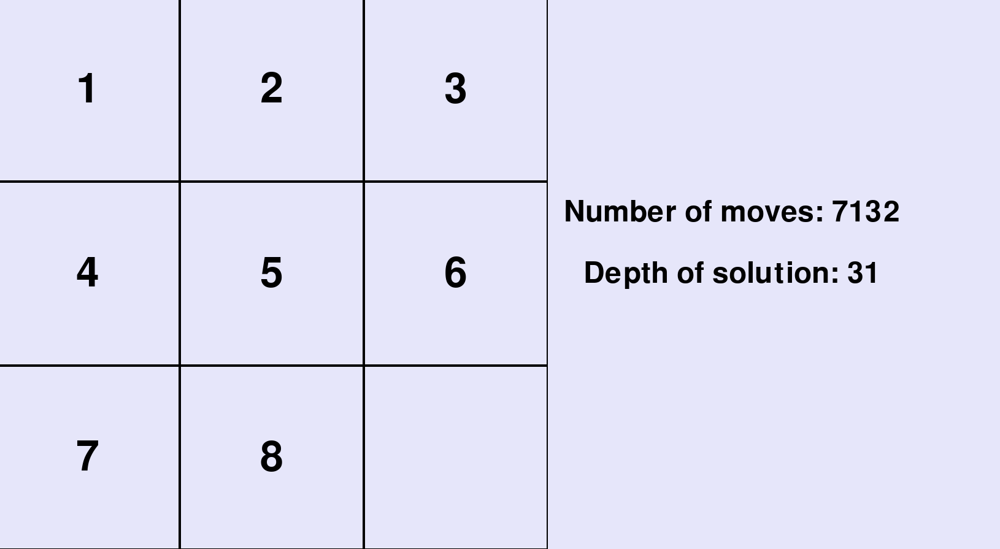

**Overview**
1. The goal of this side project is to use A* to solve 8 piece sliding puzzles.
2. My heuristic or h(n) is the total manhattan distance of every tile to its goal position.
3. My calculation for how far my algorithm has gone is the current depth of the search tree or g(n).
4. My algorithm works by minimizing f(n) which is h(n) + g(n).
5. If the current path exceeds a path that is earlier in the tree my algorithm resets the board to the earlier and cheaper state.

**Running My Code**
1. To run my code first clone the remote repository to your local machine.
2. Install the necessary Pygane dependency shown in dependencies.txt either to your machine or virtual environment.
3. There are 2 command line arguements that follow after python3 app.py
4. The first command line arguemnt is what board you want to use, which is based on how many moves it takes to solve. I have coded a 3 move, 5 move, 9 move, 20 move, and 31 move board. All you need to pass is the number. For example python3 app.py 3.
5. The final command line arguement is optional and will cause every move to take one second versus having your computer solve it at top speed. This is especially useful for small move boards. To make the moves slow down, type in the CLI python3 app.py 3 slow.

